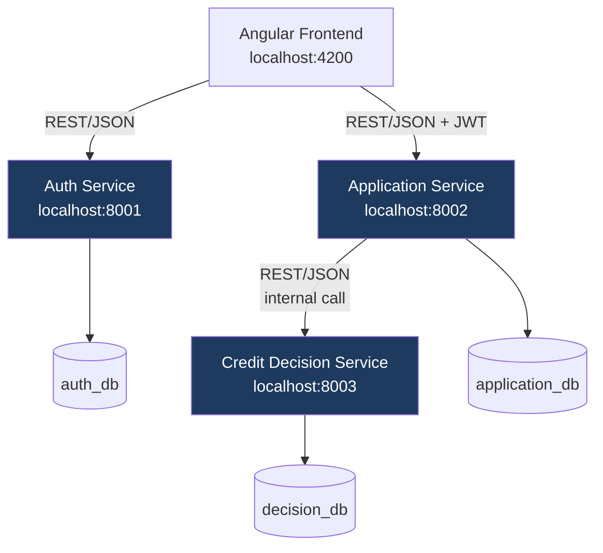
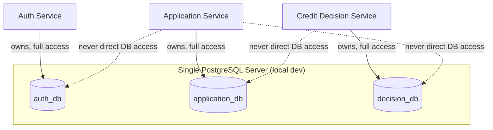
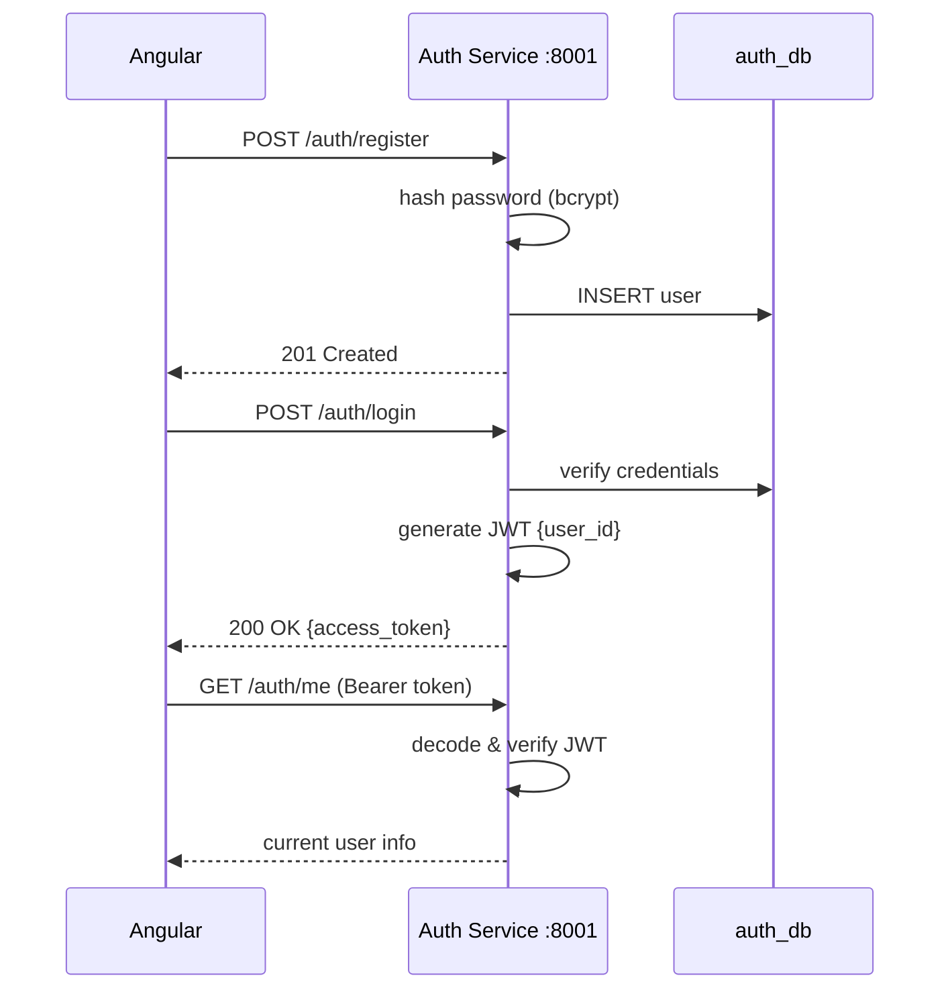
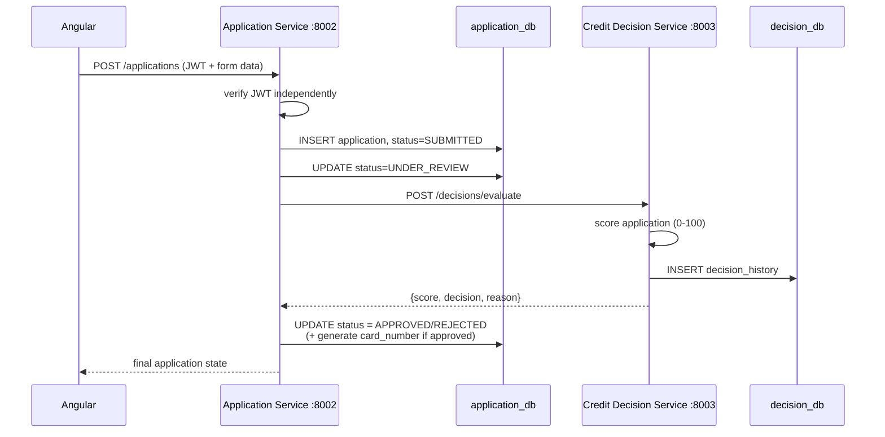
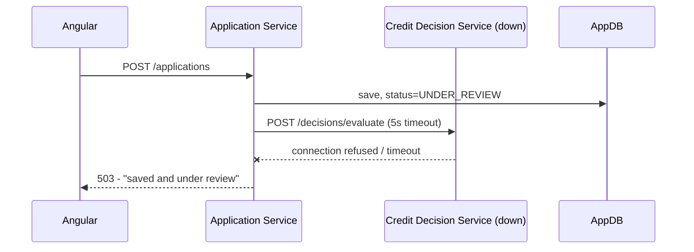

# Architecture

## Service Overview

## Database-per-Service

Each service only ever queries its own database. Cross-service data needs go through REST APIs, never direct DB access — this is what makes each service independently deployable and testable.

## Authentication Flow

**Key point**: Application Service verifies the same JWT independently using a shared `JWT_SECRET_KEY` — it never calls Auth Service to check token validity. This is stateless authentication: less coupling, but no instant token revocation.

## Application → Decision Flow

## Failure Handling

No retries or circuit breakers (deliberately out of scope for this phase) — a downstream failure is caught, the application data isn't lost, and the user gets an honest error instead of a crash.

## Scoring Rules (Credit Decision Service)

| Rule | Condition | Points |
|---|---|---|
| Credit score | ≥ 700 | +30 |
| Monthly income | ≥ ₹50,000 | +30 |
| Existing loan | < ₹200,000 | +20 |
| Employment | Salaried | +20 |
| Employment | Other | +10 |

**Score ≥ 80 → APPROVED, otherwise REJECTED**
